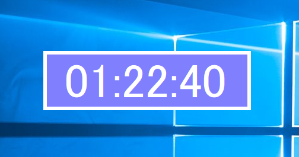

# FloatingTimer
Floating timer application. This works on Windows.

# Sample

# Comment
This is my first application with C#.
If this code is not readable, it is not problem because done is better than perfect!!